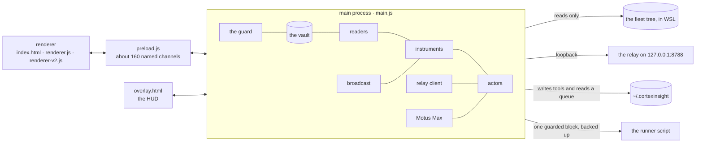

# Architecture

CortexInsight is one Electron app with three processes and one big file. This page walks the structure the way the code is laid out, names the organs of the main process in the order they appear, and says where every byte on disk lives.

## The shape



## Processes

```
main.js            the main process: state, readers, guard, fleet, relay, loops, drive, broadcast, harnesses
preload.js         the bridge: about 160 named channels, one per IPC handler, exposed as window.cortex
src/index.html     26 view sections, the titlebar, the gate, the reader modal
src/renderer.js    the v1 renderer: NAV, setHTML, the gate, Pulse, Settings, About, the reader
src/renderer-v2.js the v2 renderer: same-named functions supersede v1 (later declaration wins)
src/overlay.html   the Motus Max HUD, a transparent click-through window over every display
preload-overlay.js the HUD's bridge
```

The renderer is sandboxed: `contextIsolation` on, no `nodeIntegration`, a fixed preload, a Content Security Policy that allows only self, Google Fonts, `data:` and `file:` images for the studio, and `blob:`/`data:` media for voice. Every IPC handler is wrapped by `requireGate`, which refuses calls until the gate has been passed and turns any thrown error into `{ error }` rather than an unhandled rejection.

## The main process, organ by organ

`main.js` is long on purpose: one file, read top to bottom, with banners between organs. The order below is the file's order.

### 1. Boot, vault, utilities

- `defaultState()` is the schema. Every setting has a default and a comment saying why. `loadState()` merges forward so an older vault gains new fields without losing old ones, and falls back to `.bak` if the main file is corrupt.
- `saveState()` is atomic: write `.tmp`, copy the current file to `.bak`, rename into place. `app.requestSingleInstanceLock()` keeps a second launch from clobbering the first.
- `root()` is the fleet tree (a UNC path into WSL). `rootParts()`, `wslDistro()`, `wslUser()`, `wslHome()` and `linuxRoot()` derive the machine's identity from that path. `discoverRoot()` finds a tree on first run without knowing any names. `projectRoot()` finds the tree this build was packaged from, or returns null.
- `readDelta()` and `readDeltaAsync()` read only the bytes appended since the last read and return `{ text, carry, full }`. `readTextCached()` is a stat-gated read cache. `ixFrozenLoad/Save/Touch` keep a frozen index of past interactions on disk so a boot parses the growth, never the history.

### 2. The guard

`GUARD` holds the fingerprint (`sha256(MachineGuid:Win32 UUID)`) and the corroboration signals (the WSL tree is readable, the loopback relay answers). A fresh vault pairs itself to the first machine that opens it. The gate needs a passphrase whose SHA-256 lives in the vault; `authSetup` sets it on first run. The renderer sees a decoy IP and never the real one. The foreign-device path writes a record, fires a native notification, and optionally POSTs to a beacon URL and sends a canary email.

### 3. Readers

- `parseInteractions()` reads the interactions JSONL under `logs/interactions`, memoised by a signature of all files plus the frozen index.
- `transcriptCandidates()` and `transcriptFileWritesWarmAsync()` walk the Claude Code project transcripts, single-flighted so a refresh in flight is returned, never duplicated.
- `currentWork(agent)` pulls the live inbound ask from the session transcript, because the interactions log only lands when a turn completes.
- `usageRefreshAsync()` meters real `usage` blocks from transcripts: input, output, cache read, cache creation, per model, in rolling windows.
- `parseSubagents()` reads Task/Agent tool calls and their results.
- `seatClock()`, `fastestHands()` and `seatQuality()` read each seat's measured pace and its receipt quality.

### 4. The fleet, the bridge, the brief

- `FLEET` is the registry: id, name, lane (`relay`, `openrouter`, `openai`), tone, role, effort, `maxTurns`, and whether the seat can code. Every screen derives from it.
- `agentCfg()` resolves per-seat model, effort, turns and pause from `STATE.fleetConfig`. `publishFleetConfig()` writes `~/.cortexinsight/fleet.json` atomically.
- `installBridge()` adds one guarded block to the runner script (`cortex-run.sh`), anchored after the tools line, with a timestamped backup and a `bash -n` check that rolls back on failure. The block reads `fleet.json` every turn, exports the per-seat model and turns, wraps `claude` with the effort flag, and prepends `brief.md` to the message.
- `writeBrief()` composes the brief: the reading first, then Motus, Goal, the open board with short ids, and the strongest learnings. The bridge hands agents the first two thousand characters, so order is everything.
- `relaySend()` posts to `127.0.0.1:8788/v1/chat/completions` for relay seats, refuses non-relay lanes with a plain message, and branches to `openaiSend()` for the `openai` lane.

### 5. The inbox

The app writes `~/.cortexinsight/ci.sh` and `README-FOR-AGENTS.md` on every boot. An agent runs `ci.sh <verb> …`, which appends one JSON line to `inbox.jsonl`. `ingestAgentInbox()` reads forward from a persisted byte offset, consumes only complete lines, validates each operation and applies it: task, doing, done (with `evidenceFor()` corroboration), claim, ask (a waiting priority-1 question task), hand (delegation, propose-only at cap 0), learn, note, image (the studio, under a per-day cap).

### 6. The board

`STATE.tasks` with jobs per task. `parseTaskGrammar()` reads a title for priority, agent, tags and a park mark. `taskSweep()` finds stale work. `closeCandidates()` and `closeAct()` propose and perform the close. `duoNextAdd/Act` is the NEXT tray. A WIP limit and the flow line are computed in `boardReport()`. `triageDerived()` turns a finding that persists across two watchdog sweeps into a board task that closes itself when the condition clears.

### 7. Loops and Duo-Drive

- `LOOP_KINDS`: design, refine, review, compound, scout, artifact. `DUO_MODES`: complement, harden, scout, compound, design, motivus.
- `LOOP_CONTRACT` is the report shape every pass must return: TITLE, CONFIDENCE with BASIS, FALSIFIER with a clock, SHUTTLE (one lived turn walked), DID, FILES, NEXT. `LOOP_CRITIC` runs before the report. `receiptQuality()` scores the report 0 to 10 from what it carries. `fileLikelyExists()` downgrades a shipped claim to reported when the named file is not there.
- `duoLoopPass()` runs the due loop with `DAVARA_SIGHT`, the organs for its kind (`dvOrgansFor`), the project ethos and the reading. `nextDueLoop()` is round-robin by `lastRun`. `cadenceStretch()` and `loopQualityStretch()` make a skipping or low-scoring loop wait longer. `parseLoopProposal()` saves a loop an agent authored as `approved:false, enabled:false`.
- `duoContext()` returns a signature; a cadence pass whose signature has not changed is skipped, so an idle pass costs nothing.

### 8. Workflows

`wfNormalize()` (up to 12 stages), `wfSave/Delete`, `wfEstimate()` (prices a run in input tokens), `wfRun()` (stages in order, parallel seats within a stage, a 4,000-character HANDOFF carry), `wfResume()` (from the stage after the last success, seeded with its real output), gates (`VERDICT: PASS|BLOCK`, a BLOCK halts and files a priority-1 task, PASS below confidence 5 is a block), `fireTriggers()` (fault, task, duo; cooldown; one workflow per event), `sweepZombieRuns()` on boot.

### 9. Systems readings

`systemDynamics()` computes the ring, today's and the peak window, stocks, flows, delays, loops, extremes and readings including the attractor. `systemReading()` compresses that into one sentence and rides in the brief, the loop prompts and the strategic read. `learningsApplied()` joins learnings to closed work by word bags. `mapCortex()`, `strategicRead()` and `divergentFrames()` read the ecosystem canon at three altitudes.

### 10. Motus Max (OmniDrive)

- `omniDefaults()` is the arm state: scope (guarded or open), pacing (auto or ask), an allow-list of windows, time to live, `maxSteps`, HUD, dry run, depth, continuous chains, `moveMode` (auto, work, screen), `preRead`, `speedEffort`, `vision` (on demand), `reflex`.
- `omniPreRead()` runs the strategic read the moment you arm, so the drive starts on a ready choice. A read she was not sure of sets pacing to ask for the first batch.
- `ENV_FAMILIES` is the adaptive interface engine: browser, terminal, editor, files, notes, design, app; each family carries the instruments that fit it.
- Her own instruments are verbs in double brackets: `[[OS:read]]` a file, URL or directory (under the operator's home roots only), `[[OS:api]]` an endpoint (writes confined to the operator's own hosts), `[[OS:work]]` a command, `[[OS:show]]` a file, URL or window so the operator can see, `[[OS:see]]` and `[[OS:look]]` for the screen, `[[OS:click/type/key/focus/launch/visit/wait]]`, and the speech verbs `say`, `ask`, `need`, `note`, `done`.
- `omniRouteCycle()` is the reflex router: cycles where the plan is set go to the leanest sound seat; every cycle that forms the plan returns to the mind.
- The HUD (`overlayWin`) is one window across the union of all displays, click-through, content-protected so her own screenshots never show it.
- The panic key halts everything. Protected windows (password managers, wallets, banking, sign-in and Windows security screens) are refused. `omniSecretish()` refuses to type or send anything shaped like a credential.

### 11. The mind

`dvDir()`, `dvRead()`, `dvSection()`, `dvOrgansFor()`, `dvVersion()` and `dvAvailable()` read a Davara baseline clone from the WSL home. `mindReport()` assembles the organs per loop kind, the stack from `LAYERS.json` (order, name, trust, mutable, runtime), the recent stream, the commands, the abilities and the covenant.

### 12. MotusLive (broadcast)

`onAirDefaults()` is off with nothing selected. `onAirCandidates()` gathers what could be shown: the two focuses, the open thread, the board, recent moves, per-agent focus lines, and custom notes. `onAirPayload()` builds only from ticked items, drops anything the secret gate flags, and emits nothing beyond `on:false` when off. The host is a setting. `onAirVerify`, `onAirEnforce` and `onAirDrift` compare what the site shows with what was sent.

### 13. MotusModels, voice, the second stack, the studio

- `MM_AXES` (portability, payout, mover-pull, proof, resonance) score a MotusModel; `MM_STATUS` runs draft, ratified, minted, broadcast.
- Voice: local speech recognition in the renderer; text to ElevenLabs from the main process only; the key adopted from a machine file or pasted, verified against `/v1/voices`, then sealed. `speakable()` strips what should not be read aloud.
- OpenAI: `verifyOpenAIKey()` against `/v1/models`, `openaiSave()` seals, `openaiSend()` is the GPT seat, `imageGenerate()` writes to the `studio` folder in user data, `studioList/Delete` manage it. `omniSecretish()` guards OpenAI-bound text.

### 14. Self-update and harnesses

`stagedBuild()` looks for a newer build beside the project tree; `cortex:updateApply` writes a PowerShell swap script that polls for exit, retries the rename, verifies the version, rolls back on failure, and deletes staging only after proof.

Harness flags: `--smoke` (sandbox vault, every view, shipped defaults, screenshots, report), `--clicktest` (sync work behind start buttons, cold and warm), `--voicetest`, `--strategytest`, `--omnitest`, `--drivetest`, `--livetest`, `--flowtest`, `--lanetest`, `--airtest`, `--drifttest`. Reports land in `%TEMP%` as `ci-smoke-report.txt`, `ci-click-report.txt` and `ci-drift-report.txt`.

## The renderer

- `NAV` in `renderer.js` is the list of views: id, label, glyph path, hue, wing. `buildNav()` draws the rail. `switchView()` sets `--view-hue`, which is a registered CSS property with a transition, so the light eases between rooms.
- `setHTML()` hashes the markup and only touches the DOM when it changed; a change pulses once. Listeners attach unconditionally after `setHTML` and are idempotent.
- `renderer-v2.js` redefines the same-named view functions with richer bodies. The v1 bodies stay in place as dead code rather than being deleted under load.
- Text is never sliced in JavaScript. Long text is rendered whole and clamped in CSS; clicking opens it. The reader modal shows any body in full.
- One canvas (`startField()`), DPR 1, capped at 20 fps, stops on blur and on `visibilitychange`. No blur filter sits behind it.

## Data on disk

| Where | What |
|---|---|
| `%APPDATA%\cortexinsight\cortex-insight-state.json` (+ `.bak`) | the vault: settings, focuses, board, loops, work ledger, workflows, runs, fleet config, control, omni state and audit, learnings, next steps, notifications, integrity alerts |
| `%APPDATA%\cortexinsight\ix-frozen.json` | the frozen index of past interactions |
| `%APPDATA%\cortexinsight\integrity\*.txt` | integrity snapshots of the critical fleet files |
| `%APPDATA%\cortexinsight\studio\` | images the studio made |
| `~/.cortexinsight/fleet.json` | per-seat config the bridge reads every turn |
| `~/.cortexinsight/brief.md` | the shared brief, prepended to every message |
| `~/.cortexinsight/ci.sh`, `README-FOR-AGENTS.md` | the agent tool and its manual, rewritten on boot |
| `~/.cortexinsight/inbox.jsonl` | the append-only queue from agents |
| `~/.cortexinsight/motusmodels/` | minted MotusModels and broadcast payloads |
| `~/.cortexinsight/live-secret` | the write credential for the broadcast host |

Secrets in the vault (`smtpAppPasswordEnc`, `elevenKeyEnc`, `openaiKeyEnc`) are base64 of `safeStorage.encryptString`, DPAPI on Windows. `safeSettings()` strips every `*Enc` field and the passphrase hash before anything reaches the renderer and returns `keySet` booleans instead.

## Performance laws

1. No synchronous file work behind a click. Anything that touches the WSL bridge runs async, single-flighted, stale-while-revalidate.
2. Read the growth, never the history: delta reads with a carry, a frozen index for the past, stat-gated caches for the rest.
3. One canvas, capped, stopped when hidden. No blur filter behind it.
4. Render only when the data changed; pulse the change once.
5. Poll at seven seconds; the eye cannot tell it from four, and the bridge can.
