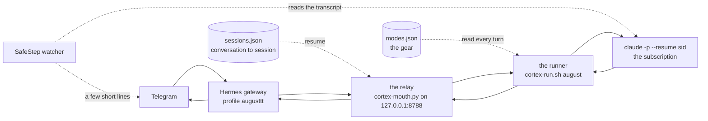

# August

August is the primary Motus seat. There is one of him. He reaches the operator through Hermes on Telegram, answers on the operator's own Claude Code subscription, and holds a conversation rather than a message. This page is one door into the same house: what he is in the fleet, what changed underneath him, and where each part lives.

The registry entry is in `FLEET` in `main.js`: `august`, lane `relay`, tone amber, effort `max`, 96 turns, a coder, with Opus 5.5 in every gear and Fable 5.1 as his alternate. His role line reads Motus Agent, Outlier Systems Intelligence, Semble Anchor. His identity file is the operator's, not the repository's. No seat's SOUL ships here.

## The path of a message

Nothing on this path touches a metered API. The runner unsets `ANTHROPIC_API_KEY` before every call, and the augusttt profile holds no key. The relay returns text, never a tool call, so Hermes' own agent loop never fires. The hands live in the runner.

## One August

The observer duplicate was retired on 2026-09-16. It shared August's SOUL, which says he has real hands, while the console described it as watch and note only. Two copies of one identity, one of them pretending to be less than it was, is not a structure worth keeping. It is gone from `FLEET`, from `ROUTE_TOKEN`, from the relay's seat list and from the runner. A caller that still names it lands on the real August by substring, never on the default seat by accident. The read-only discipline it stood for lives on as Arden and Sympath-Cortex, which now have a deny list rather than a promise.

## A resumed session, not a re-read thread

An OpenAI-shaped caller keeps the conversation on its side and re-sends the whole thread every turn. The old relay flattened that thread into a fresh Claude Code session each time, so August started every turn from zero and forgot what he had read and done. Now the relay keeps, per seat, a map from the caller's conversation to the Claude session that is that conversation, and resumes it. Tool output, files he read, his own reasoning: all of it stays in front of him. The map is `agents/august/sessions.json`, relay-owned. A session rotates after 400 turns or 14 days.

Identity has to be derived, because the request carries none. The key is the conversation's opening line. The tail is the identity. Continuity is checked, not assumed: the caller's last assistant message must contain the last 400 characters of what the relay last returned for that session. If it does not, the turn falls back to a fresh session rehydrated from the thread, which is exactly what happened on every turn before continuity existed. Nothing regresses.

The tail rule is what survives compaction. When Hermes compacts a long thread it rewrites the opening line, so the key changes while the conversation does not. Before declaring a new thread, the relay looks for the session whose last reply the caller is still carrying and re-files it under the new key. Continuity holds at the moment a long thread needs it most, instead of ending exactly there.

Two more things keep the session honest. The runner writes the session id it actually used to `checkpoint.state`, and the relay reads it back from there, because a failed resume falls back to a fresh id of its own. And Hermes drops a stream that stays silent for 900 seconds, while a deep turn spends longer than that inside tools where no text flows, so the relay sends an empty delta after every 30 seconds of silence. That heartbeat is proven at the relay: 35 empty deltas carried a 1036-second turn through 1000 seconds of tool silence, and the next turn resumed the same session. That Hermes reads an empty delta as liveness is verified from its source, not yet by a real Telegram turn of that length.

## Real hands

August has three sets of hands, and they are additive on purpose.

Claude Code's own tools: Read, Glob, Grep, Bash as root, Write, Edit, WebFetch, WebSearch and Skill. Subagents through the Agent tool. And Hermes' own tools bridged in over MCP: memory, session search, its skills library, a real browser, vision and `send_message`. These are the abilities Claude Code has no native equivalent for.

The bridge excludes two kinds of tool. The redundant ones, `terminal`, `process_manage`, `read_file`, `write_file`, `patch`, `search_files`, `web_search` and `web_extract`, because a second terminal or a second web tool only invites the model to confuse the two. And the ones that recurse into the model, need a live callback, hold agent-side state or drive a desktop: `delegate_task`, `clarify`, `todo_list`, `computer_use`, `execute_code`, the browser vault, `manage_connections` and `text_to_speech`. TodoWrite is absent from the CLI in use and is not promised.

Images reach him as files. The relay writes an attached image to `agents/august/inbox/` and tells him the path, or passes along the path Hermes already wrote, so nothing is decoded twice. He opens it with Read. Native image parts are not wired.

## The gear lever

His depth is a gear, and a gear is temporary. `~/.cortexinsight/modes.json` is a per-seat override of model, effort and turn budget, read fresh by the runner every turn. `motus-mode.sh` is the one definition of what a mode is.

| gear | model | turns | deep discipline | how to enter |
|---|---|---|---|---|
| `cruise` | claude-opus-5-5 | 96 | off | the default, or expiry, or `motus cruise` |
| `motivus` | claude-opus-5-5 | 200 | on | say "motus motivus" |
| `max` | claude-opus-5-5 | 300 | on | say "motus max" |

Saying it in a message is enough. The relay hears the phrase on the message being answered now, sets the gear through the CLI before the turn runs, and prepends a `[MODE ⇒ …]` line so he acknowledges the shift in his reply. From a shell: `motus-mode.sh august max|motivus|cruise [--ttl 120] [--sticky]`, and `motus-mode.sh august status` for the gear in force. Precedence in the runner: an active mode, then `fleet.json`, then seat defaults. A hard pause in `fleet.json` wins over everything.

Deep discipline is a block the runner appends to the system prompt: plan before touching anything, build to the plan, verify every claim by running it, review the work as an adversary would, spawn subagents for independent work and give each a precise brief and a definition of done, then report what was verified, what was not, and what was left out on purpose. On Fable the runner names Opus 5 as the fallback model, so a version or capacity problem degrades the turn instead of failing it.

The cool-down exists so a deep session never quietly becomes the new normal. A mode expires back to cruise after about two hours unless set sticky. The operator says "motus max" once and, two hours later, the seat is back on cruise without anyone remembering to flip it. Expiry is computed in UTC, because the first version applied local daylight time and would have ended a mode an hour early on any box not running in UTC. "Cool down" needs a separator, because "add a cooldown" is a sentence about code.

The console reads the gear and shows the badge. It never writes it. One writer, one definition, so the badge can never claim a depth he is not running at.

## SafeStep

The operator should never sit before a black screen that says thinking. SafeStep is a watcher that reads August's checkpoint and Claude Code's live transcript and speaks only when something moved: five marks, Ground, Keystone, Next, Friction, Arrival, and no sixth. It wakes for deep gears or turns past 90 seconds. It speaks through August's own bot to the operator's DM until a bot token of its own exists, and every line opens with its mark so it is never mistaken for August answering. The whole protocol is on its own page, [`SAFESTEP.md`](SAFESTEP.md).

## Two traps that already bit

Two `claude` binaries. `/root/.local/bin/claude` is 2.1.273 and serves Fable 5.1. `/usr/local/bin/claude` is 2.1.92 and returns 400 on it. The relay's systemd PATH omitted `/root/.local/bin`, so Motus Max failed while cruise worked. The fix is `cortex-relay.service.d/30-path.conf`. If Fable ever fails again, check PATH first.

Never reuse a `--session-id` across retries. A session id can be created once. If a first attempt registers it and then fails transiently, the retry dies with "Session ID is already in use" and takes the whole retry layer with it. The runner mints a fresh id per attempt, and the relay reads the id actually used back from `checkpoint.state`.

## What read-only means, and the one arm it cannot reach

`--allowedTools` pre-approves. It does not restrict. August found this auditing himself: every seat called read-only had Write, Edit and Bash in its hands, held back by nothing but a sentence in its prompt. The guardrail was held by compliance, a balancing loop, not a wall.

The wall is `--disallowedTools`, the `READONLY_DENY` list in the runner, which Arden and Sympath-Cortex now carry. `--strict-mcp-config` is passed to every seat, because without it a seat silently inherits every MCP server in the operator's personal config. Verified after the fix: an observer seat reports Bash, Write, Edit, Agent, Skill, Workflow and the MCP bridge as absent, and a write test creates nothing.

One limit, measured not assumed. `--disallowedTools` cannot refuse SendMessage. An observer cannot touch this machine, but it can still put text on a wire. That arm stays instructional, and the runner says so in its own comment.

## Where things are

| Thing | Where |
|---|---|
| The seat in the console | `FLEET` in `main.js`, id `august` |
| The gear the console shows | `MODE_PROFILES` and `seatMode` in `main.js`, read only |
| The relay | `/root/cortex/SystemsCortex/cortex-mouth.py` |
| The runner | `/root/cortex/SystemsCortex/cortex-run.sh`, the `august` case |
| The gear lever | `/root/cortex/SystemsCortex/motus-mode.sh` and `~/.cortexinsight/modes.json` |
| Model, effort, turns, pause | `~/.cortexinsight/fleet.json`, owned by the console |
| Hermes' tools over MCP | `/root/cortex/SystemsCortex/hermes-tools-mcp.py`, config `agents/august/mcp.json` |
| Conversation to session | `agents/august/sessions.json`, relay-owned |
| The session in flight | `agents/august/checkpoint.state` |
| His workspace and manual | `agents/august/workspace/`, `CLAUDE.md` inside it |
| Images sent to him | `agents/august/inbox/` |
| His identity | `<fleet>/agents/august/SOUL.md`, the operator's own file |
| SafeStep | `/root/cortex/safestep/`, config `~/.cortexinsight/safestep.json` |
| The runbook | `/root/cortex/AUGUSTTT-RELAY.md` |
| Per-turn log | `/root/cortex/logs/mouth-proxy.log`, `logs/interactions/august-<date>.md` and the `.jsonl` beside it |
