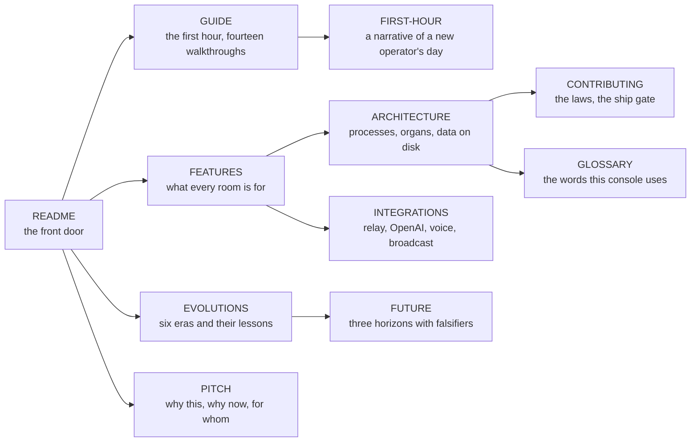
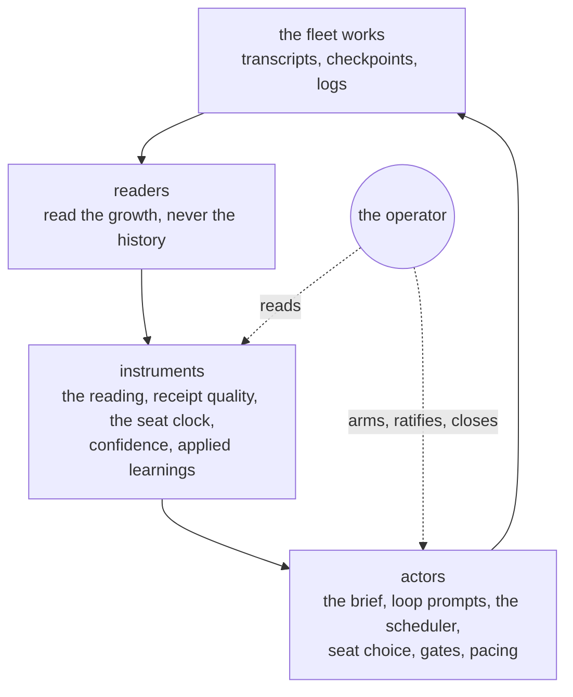
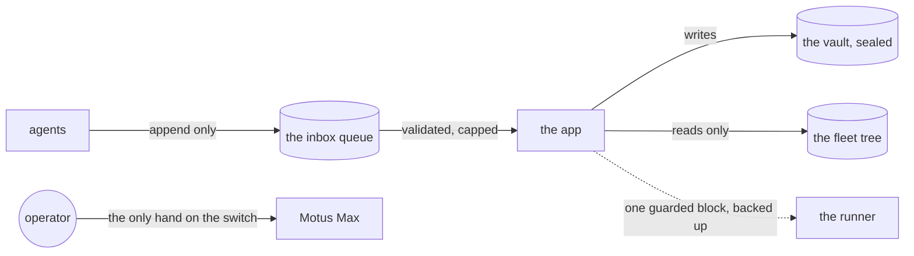

# The documentation

Start here. Each page below is one door into the same house. Read them in the order you need, and come back to this map when you lose the thread.

## The map

| Page | Read it when |
|---|---|
| [`PITCH.md`](PITCH.md) | You want to know whether this console is for you, in five minutes. |
| [`GUIDE.md`](GUIDE.md) | You have it running and want to do something real with it. |
| [`FIRST-HOUR.md`](FIRST-HOUR.md) | You want to see a whole first session, told as a story, before you start your own. |
| [`FEATURES.md`](FEATURES.md) | You want to know what a room is for, why it exists, and which module makes it work. |
| [`ARCHITECTURE.md`](ARCHITECTURE.md) | You are about to change something and need to know where it lives. |
| [`GLOSSARY.md`](GLOSSARY.md) | A word in the app or the docs is new to you. |
| [`INTEGRATIONS.md`](INTEGRATIONS.md) | You are wiring a key, a relay, a voice, or the broadcast. |
| [`EVOLUTIONS.md`](EVOLUTIONS.md) | You want to know how it got this way, and what each version taught. |
| [`FUTURE.md`](FUTURE.md) | You want to know where it is going and how anyone would know it arrived. |
| [`MOTIVUS-ONE.md`](MOTIVUS-ONE.md) | You are the founder, or you want to know what the paid tier could hold. |
| [`../CONTRIBUTING.md`](../CONTRIBUTING.md) | You want to change it, or propose something. |
| [`../SECURITY.md`](../SECURITY.md), [`../OPEN-SOURCE.md`](../OPEN-SOURCE.md) | You want the threat model and the publishing gate. |

## The one loop every page is about

An instrument that only the operator reads is half built. Every reading in this console feeds at least one non-human decision, and the operator's attention goes to the decisions that cannot be delegated: what matters, what to arm, what to close.

## The direction of trust

Agents append. The app applies. The operator arms. Nothing in the diagram runs the other way.

## In the app

Type `/help` on Command for the commands and these links. Press Ctrl+K and type `guide`. The About panel on Config links every page here.
