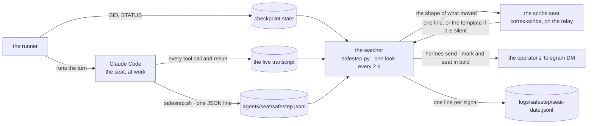

# SafeStep

The operator should never sit before a black screen that says "thinking." A deep turn can run for an hour inside tools. Nothing arrives, and nothing arriving is indistinguishable from nothing happening. SafeStep is the small voice that closes that gap. It reads what a working seat leaves on disk and tells the operator, in one line, when something moved.

It is a clarity protocol, not a progress bar. Ground is gained in steps. A step worth taking is a step worth saying.

## The one law

**Speak only when something moved.** Not on a timer, not to fill silence, not to perform effort. A line is earned by ground gained, a door only the operator can open, a road worth naming, a wall met honestly, or an arrival. Everything else is quiet, and the quiet is a promise: still moving, nothing you need to see yet.

## The five marks

Five marks. No sixth. A message that fits none of them is not sent.

**◆ Ground.** A milestone is real. A file exists, a check passes, a deploy answers, a subagent returns. The line carries what now exists that did not before.

**◇ Keystone.** A question only the operator can answer, and the work cannot honestly proceed without it. The line carries the question, the two live options, and what happens if it goes unanswered.

**→ Next.** A move worth naming, seen from inside the work. One next move, at most two real alternatives.

**⧗ Friction.** A wall met. A failure, a missing thing, a limit, and how it is being handled. The line says whether help is needed.

**● Arrival.** The work is done, or has stopped. What moved, what was verified, what was left out on purpose, the one next move.

The watcher can derive Ground, Friction and Arrival on its own from the transcript. Keystone and Next can only come from the seat, because only the seat knows a question has arisen or which road it means to take.

## Cadence

**Wake.** A quick answer needs no narrator. SafeStep wakes at once for a seat in a deep gear, `motivus` or `max`, read from the same `modes.json` the runner and the console read, with the same expiry. For any other turn it wakes only once the turn has run past 90 seconds.

**Floor.** Ground lines are at least 90 seconds apart. Events batch, and the batch becomes one line. Keystone and Friction may break the floor, because waiting on them costs the operator time: a derived Friction after 20 seconds, and only after a run of three errors; the seat's own lines within five. After twelve lines in one turn the derived ones stop. The seat's own still go.

**Ceiling.** Silence is bounded. If the work is alive but nothing meaningful has moved for six minutes, one honest line: still moving, how many tools, how long in, and which tool it is inside right now. A long command writes nothing while it runs. That is not a stall; it is a seat inside a command, and the line says so.

**Arrival always lands** for a turn SafeStep woke for, even if nothing else did. A turn the relay cut short arrives as "stopped after", not as silence.

## Two sources, one voice

**The watcher** (`safestep.py`) reads the runner's `checkpoint.state` for which session is in flight, finds Claude Code's own live transcript of that session, and tails it. It needs nothing from the seat, cannot slow it, and cannot break it. It sees every tool the seat uses and derives Ground, Friction, Arrival and the bounded still-moving line from raw events. A resumed session's transcript already holds every earlier turn, so the watcher starts reading from where the file is now, or its first line would proudly summarise last week.

**The seat itself** speaks through five words:

```bash
safestep.sh step     "<what now exists that did not before>"      # ◆ Ground
safestep.sh ask      "<question · option A · option B>"           # ◇ Keystone
safestep.sh next     "<the one move worth naming>"                # → Next
safestep.sh friction "<the wall · how it is being handled>"       # ⧗ Friction
safestep.sh done     "<what moved · next move>"                   # ● Arrival
```

Each call appends one JSON line to `<fleet>/agents/<seat>/safestep.jsonl`. The watcher forwards it at once. Explicit signals outrank derived ones and are never batched away. They wait at most a few seconds, for the chat's rate limit, and go. If the watcher is not running, the line simply waits. It is always safe to call.

The watcher makes SafeStep reliable. The seat makes it meaningful. Neither depends on the other.

## The path of one line



The scribe is asked for the shape of what moved, not a diary of tool calls: one line, under 200 characters, beginning with the mark. A line that does not begin with a mark, or runs past 240 characters, is dropped for the watcher's own plain template. Either way the format holds on the phone: the mark and the seat in bold, a middle dot, the meaning.

## Whose voice

Today SafeStep speaks through August's own bot, to the operator's DM (`transport: hermes`, `hermes_profile: augusttt`). It has no bot of its own yet. Every line opens with its mark and seat in bold, so it is never mistaken for August answering.

When a BotFather token exists, the switch is three lines and no code:

```bash
hermes profile create safestep --no-skills --no-alias --description "SafeStep — send-only"
printf 'TELEGRAM_BOT_TOKEN=<token>\nTELEGRAM_ALLOWED_USERS=<your id>\nTELEGRAM_HOME_CHANNEL=<your id>\n' \
  > ~/.hermes/profiles/safestep/.env && chmod 600 ~/.hermes/profiles/safestep/.env
# then in ~/.cortexinsight/safestep.json:  "hermes_profile": "safestep"
```

Never start a gateway for that profile. `hermes send` needs none, and a gateway would long-poll the bot. Do not borrow another seat's bot for it. A voice that sounds like someone else is the one thing this protocol must never be.

The token, the chat and the profile are the operator's. They live in `~/.cortexinsight/safestep.json` and under `~/.hermes/profiles/`; the example config the repository ships names none of them.

## What SafeStep will never do

Narrate every tool call. Ask a question it could answer by reading. Send a line it would not want to read at 2 a.m. Pretend a wall is a milestone. Speak for a seat that is not moving.

## Where it lives

SafeStep runs from the fleet tree, beside the relay. The repository carries its parts in `linux/safestep/`: the seat's voice, the unit, an example config and the codex. `linux/install.sh` copies what that folder holds into `<fleet>/safestep/`, writes the unit with your paths, seeds `~/.cortexinsight/safestep.json` from the example if none exists, and enables the service. A fresh install is silent until that file names a chat.

- `~/.cortexinsight/safestep.json` — who to tell, through which voice, and the cadence knobs. Read fresh whenever it changes; no restart.
- `<fleet>/safestep/` — `safestep.py` (the watcher), `safestep.sh` (the seat's voice), `CODEX.md` (the protocol itself).
- `~/.config/systemd/user/safestep.service` — the unit. It starts after the relay only so its first look is at a settled tree. It never touches the relay or the runner.
- `<fleet>/agents/<seat>/safestep.jsonl` — the seat's explicit signals, one JSON line each.
- `<fleet>/logs/safestep/<seat>-<date>.jsonl` — every signal sent, derived or explicit, so the day can be read as steps. `.offsets.json` beside it is why a restart does not replay old signals, and `watcher.log` is where the watcher explains itself.

Set `SAFESTEP_DRY=1` and the watcher prints its lines instead of sending them.

## A build, narrated

Here is the shape of one deep turn, as its lines would land on the operator's phone. The first, fifth and last lines are the watcher's. The second, third and fourth are the seat's own.

```
◆ august · The watcher now exists: safestep.py reads the checkpoint and the live transcript, and a dry run prints its own steps.
◇ august · Speak through August's bot for now, or wait for a SafeStep token? His bot costs nothing today; a token gives it a voice of its own.
→ august · Wire the scribe next, so a Ground line says what moved instead of counting files.
⧗ august · hermes send rendered underscores as italics · switched the line to HTML so the mark and seat go bold and the rest lands as written.
◆ august · still moving · 41 tools · 9 min in · last: inside Bash systemctl --user restart safestep for 12s
● august · SafeStep is live: watcher, CLI and unit in place, first line delivered to the DM · next: a bot of its own.
```

Six lines for a fourteen-minute build. The operator knew what existed, what was being asked of him, where the wall was, and when it was done. He did not read a single tool call.

`{{{` Ground · Keystone · Next · Friction · Arrival. Five marks. Speak when it moves.
